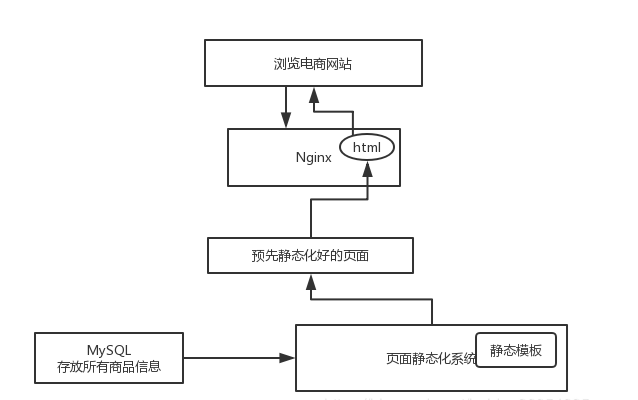

### 小型电商网站的商品详情页系统架构
  
数据库中存放了所有的商品信息，页面静态化系统，将数据填充进静态模板中，形成静态模板，发送到Nginx服务器。
用户浏览网站页面时，取用一个已经静态化好的页面，直接返回回去，不涉及任何的业务逻辑处理。  
优点:用户每次浏览一个页面，不需要进行任何的跟数据库的交互逻辑，也不需要执行任何业务代码，直接返回一个html页面就可以了，
速度和性能非常高。  
对于小网站，页面很少，很实用，非常简单，Java中可以使用 velocity、freemarker、thymeleaf 等等，
然后做个 cms 页面内容管理系统，模板变更的时候，点击按钮或者系统自动化重新进行全量渲染。  
缺点: 小规模网站比如页面规模几十到几万那种是没啥问题的，如果页面数量达到一定级别，每次渲染页面花费时间单位就是天了，不适用。